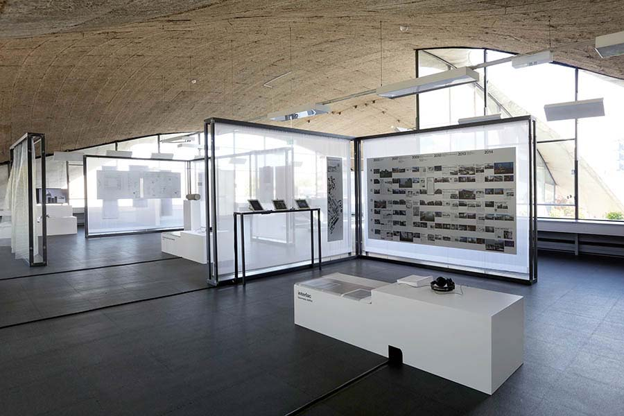
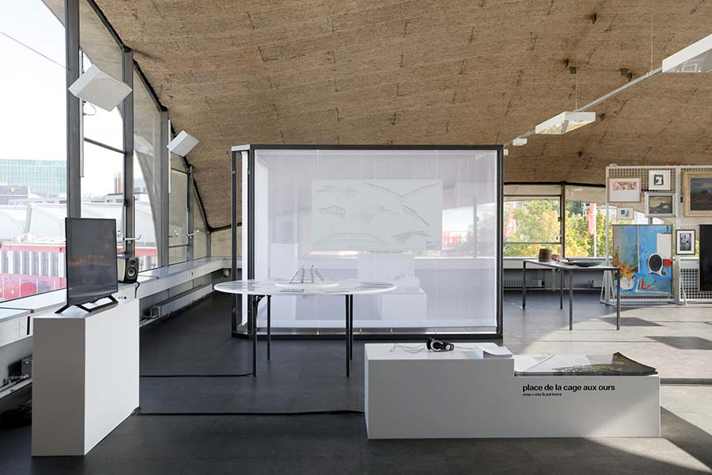
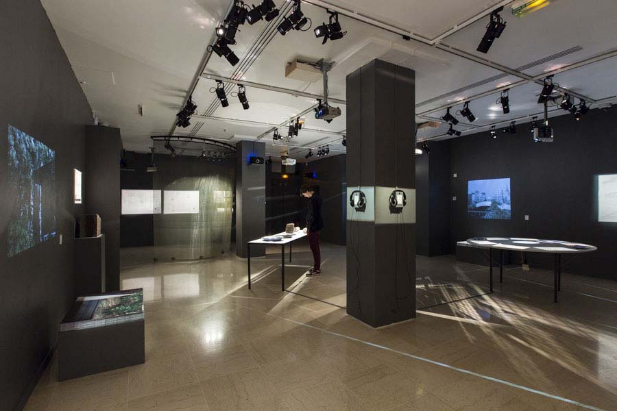
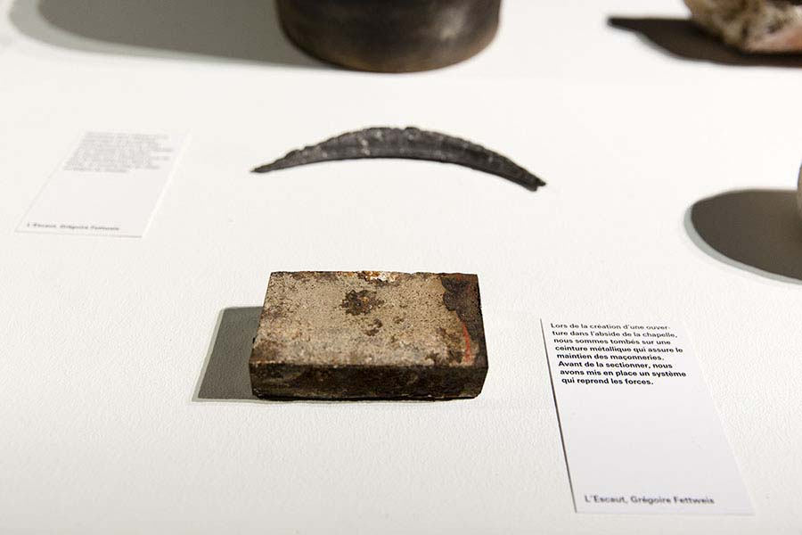
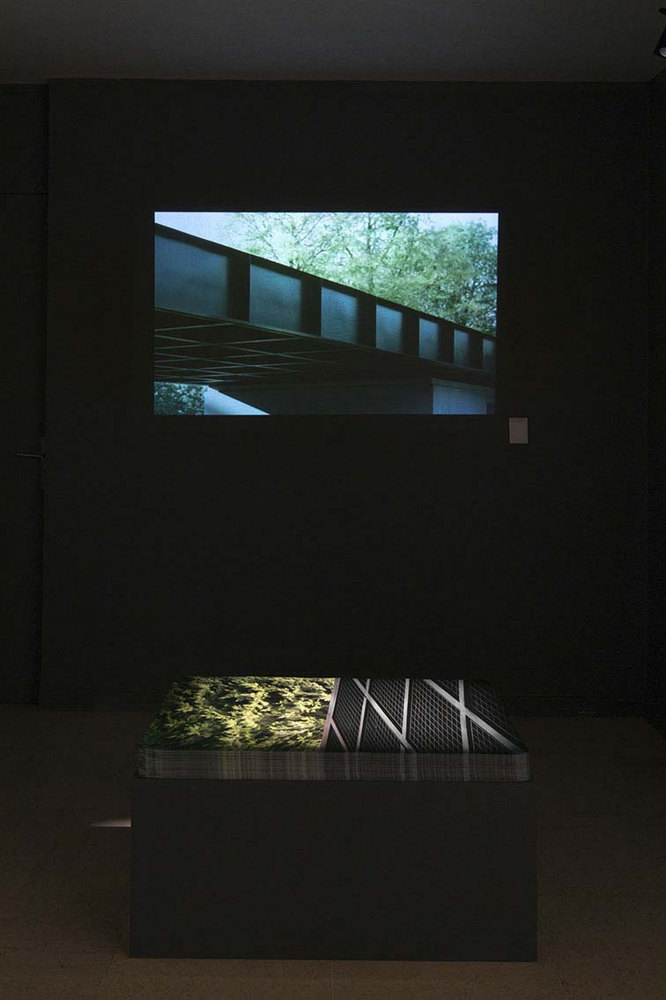

*entrer:* is an invitation to take a stroll through the traces of five committed architecture projects that have recently left their mark on the Belgian landscape. There is a former chapel that houses the reserve collections of the museums of the city of Mons (by Atelier Gigogne + L’Escaut), a sports centre that has redrawn a landscape in Spa (by Baukunst), an industrial conversion that reinforced the centre of Dison (by Baumans-Deffet), a footbridge that transformed a public space in Brussels (by MSA + Ney & Partners), and a garden pavilion in Renaix that articulates a professional kitchen and an art collection (par Vers.A).

<figure>
	
	
	<figcaption>Geneva, 2016 © Maxime Delvaux</figcaption>
</figure>

But how to convey the materiality and spatiality of architectural projects located miles away from the exhibition venue and therefore removed from their specific context? Architecture produces spaces and atmospheres that can be grasped and understood through the physical discovery of the place. The stroll emerged as not only a tool by which to grasp the spatiality and materiality of the projects, but also as an analytical method and as a medium to convey the results. It was the occasion for Audrey Contesse, curator of the exhibition, to glean and select objects relating to the history of the project and to architectural practice, and for the artists, Maxime Delvaux and Christophe Rault, to draw from it films and sound bites, respectively. These independent fragments – gleaned objects, films and sound bites – form five triptychs through which to enter, experience and understand these architectures.

<figure>

<figcaption>Paris, 2015 © vinciane verguethen</figcaption>
</figure>
