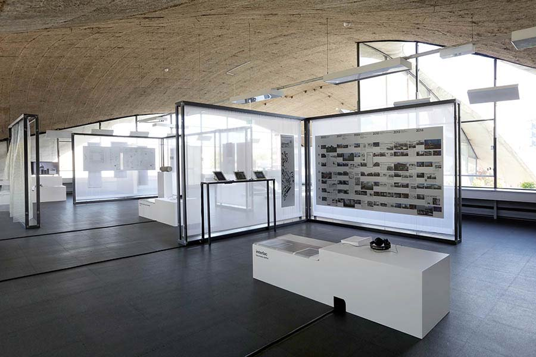
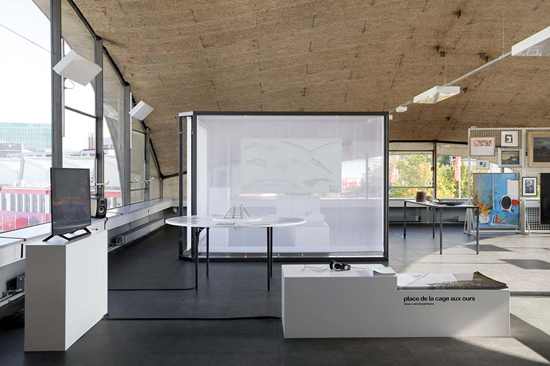
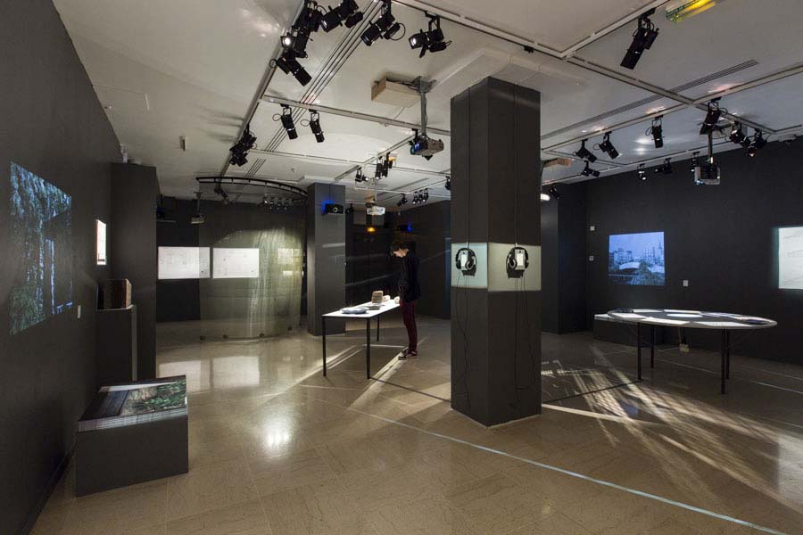
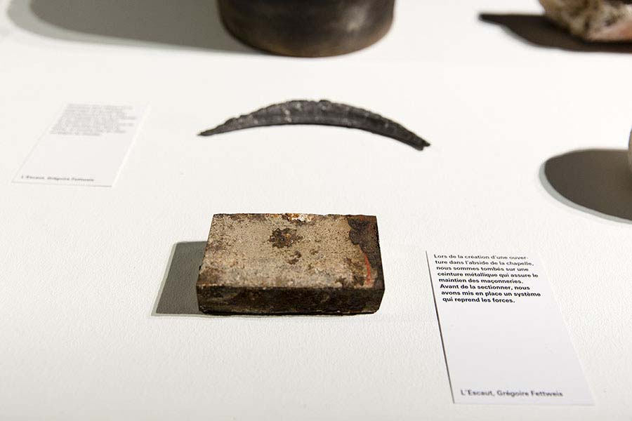
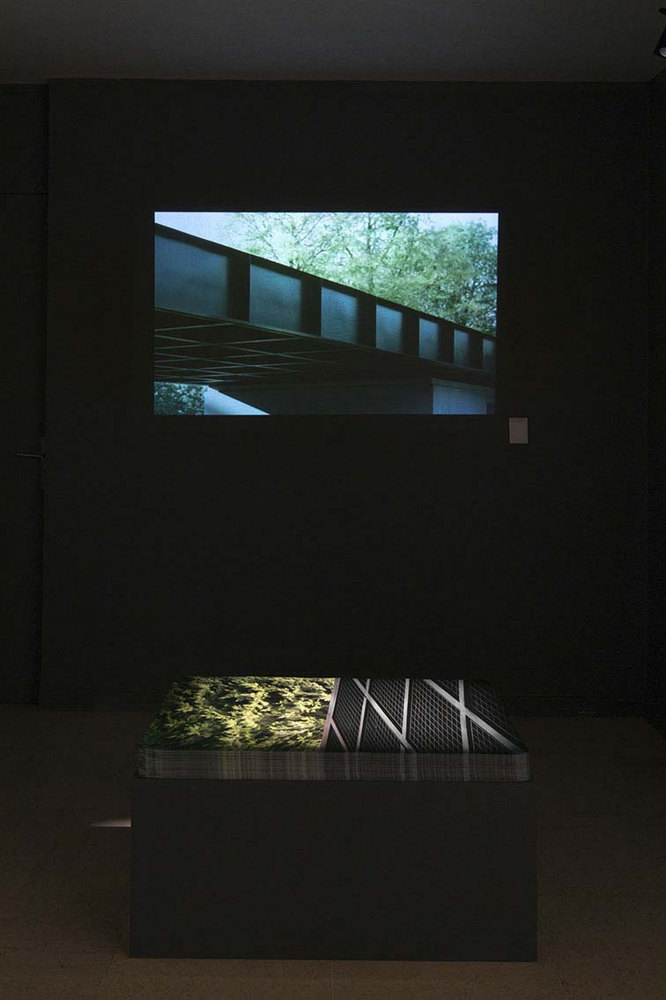

*entrer:* est une invitation à déambuler à travers les traces de cinq architectures engagées qui ponctuent depuis peu le paysage belge. S’y retrouvent: une ancienne chapelle accueillant les réserves des musées de Mons (par Atelier Gigogne + L’Escaut), un équipement sportif recomposant un paysage à Spa (par Baukunst), une reconversion industrielle renforçant le centre de Dison (par Baumans-Deffet), une passerelle métamorphosant un espace public à Bruxelles (par MSA + Ney & Partners), et un pavillon de jardin à Renaix articulant cuisine professionnelle et collection d’œuvres d’art (par Vers.A).

<figure>
	
	
	<figcaption>Genève, 2016 © Maxime Delvaux</figcaption>
</figure>

Cependant, comment transmettre la matérialité et la spatialité d’architectures situées à des kilomètres du lieu d’exposition et donc extraites de leur contexte spécifique? L’architecture produit des espaces et des atmosphères saisissables et compréhensibles par la découverte physique du lieu. La déambulation s’est alors imposée à la fois comme outil d’appréhension des projets, mais aussi comme méthode d’analyse et comme media de transmission des résultats. Elle est l’occasion pour Audrey Contesse, commissaire de l’exposition, de glaner et de sélectionner des objets de l’histoire du projet et de la pratique architecturale, et pour les artistes, Maxime Delvaux et Christophe Rault, d’en tirer respectivement des films et des capsules sonores. Ces fragments indépendants – objets glanés, films et capsules sonores – forment cinq triptyques pour entrer dans ces architectures, les ressentir et les comprendre.

<figure>

<figcaption>Paris, 2015 © vinciane verguethen</figcaption>
</figure>
